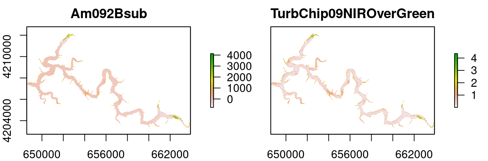

<!-- README.md is generated from README.Rmd. Please edit that file -->

[](https://cran.r-project.org/package=waterquality)
[](https://travis-ci.org/RAJohansen/waterquality)
[](https://codecov.io/gh/RAJohansen/waterquality)


# waterquality

The goal of **waterquality** is to convert satellite-reflectance imagery
to a host of pre-defined water quality algorithms designed for the
detection of cholorophyll-a, blue-green algae (Phycocyanin), and
Turbidity. This package is able to process the following sensor
configurations: WorldView-2, Sentinel-2, Landsat-8, MODIS, MERIS, and
OLCI.

## Installation

You can install the released version from CRAN with:

``` r
install.packages("waterquality")
```

You can install waterquality from github with:

``` r
# install.packages("devtools")
devtools::install_github("RAJohansen/waterquality")
```

## Examples

The main function in this package is `wq_calc()`:

``` r
library(waterquality)
library(raster)
#> Loading required package: sp
s2 = stack(system.file("raster/S2_Harsha.tif", package = "waterquality"))
s2_two_alg = wq_calc(s2, alg = c("TurbChip09NIROverGreen", "Be16FLHGreenRedNIR"), sat = "sentinel2")
#> Be16FLHGreenRedNIR calculated!
#> TurbChip09NIROverGreen calculated!
plot(s2_two_alg)
```

<!-- -->

Additional functionality include the MAP\_WQ functions:

``` r
library(waterquality)
library(raster)
library(tmap)
library(sf)
#> Linking to GEOS 3.8.0, GDAL 3.0.4, PROJ 6.3.1
s2 = stack(system.file("raster/S2_Harsha.tif", package = "waterquality"))
MM12NDCI = wq_calc(s2, alg = "MM12NDCI", sat = "sentinel2")
#> MM12NDCI calculated!
samples = st_read(system.file("raster/Harsha_Points_CRS.gpkg", package = "waterquality"))
#> Reading layer `Harsha_Points' from data source `C:\Users\RDEL1RAJ\Documents\R\win-library\4.0\waterquality\raster\Harsha_Points_CRS.gpkg' using driver `GPKG'
#> Simple feature collection with 42 features and 20 fields
#> geometry type:  POINT
#> dimension:      XY
#> bbox:           xmin: 746260.5 ymin: 4320844 xmax: 752392 ymax: 4324583
#> projected CRS:  WGS 84 / UTM zone 16N
lake_extent = st_read(system.file("raster/Harsha_Lake_CRS.gpkg", package = "waterquality"))
#> Reading layer `Harsha_Lake' from data source `C:\Users\RDEL1RAJ\Documents\R\win-library\4.0\waterquality\raster\Harsha_Lake_CRS.gpkg' using driver `GPKG'
#> Simple feature collection with 1 feature and 1 field
#> geometry type:  POLYGON
#> dimension:      XY
#> bbox:           xmin: 745632.4 ymin: 4319424 xmax: 754513.8 ymax: 4326004
#> projected CRS:  WGS 84 / UTM zone 16N
Map_WQ_raster(WQ_raster = MM12NDCI,
              sample_points = samples,
              map_title= "Water Quality Map",
              raster_style = "quantile",
              histogram = TRUE)
```

<!-- --> To learn more read the
[“Introduction to the waterquality
package”](https://rajohansen.github.io/waterquality/articles/waterquality_vignette.html)
vignette.

## Package Contributions

We encourage users to submit issues and enhancement requests so we may
continue to improve our package.

Furthermore, if you have a water quality algorithm that was not on our
list, and you would like for it to be included in our package please
email me at <richard.a.johansen@erdc.dren.mil>
