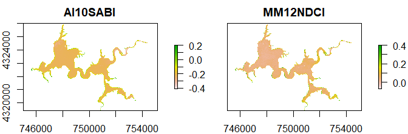

<!-- README.md is generated from README.Rmd. Please edit that file -->

[](https://cran.r-project.org/package=waterquality)
[](https://travis-ci.org/RAJohansen/waterquality)
[](https://app.codecov.io/gh/RAJohansen/waterquality)
[](https://www.r-pkg.org:443/pkg/waterquality)


# waterquality

The main purpose of **waterquality** is to quickly and easily convert
satellite-based reflectance imagery into one or many well-known water
quality indices designed for the detection of Harmful Algal Blooms
(HABs) using the following pigment proxies: chlorophyll-a, blue-green
algae (phycocyanin), and turbidity. Currently, this package is able to
process [40
algorithms](https://rajohansen.github.io/waterquality/reference/index.html)
for the following satellite-based imagers: WorldView-2, Sentinel-2,
Landsat-8, MODIS, MERIS, and OLCI. In order to improve the aesthetics of
the `wq_calc()` output, a series of `Map_WQ()` functions were developed
to help reduce technical barriers and simplify the complexities in
selecting a map layout. Additional functionality of the package includes
a series of `extract_lm()` functions that wrap the [“Fitting Linear
Models”](https://www.rdocumentation.org/packages/stats/versions/3.6.2/topics/lm)
and [“caret”](https://topepo.github.io/caret/index.html) packages to
quickly generate crossvalidated linear models and standardized outputs
(r<sup>2</sup>, p-value, slope, intercept of the global lm model &
average r<sup>2</sup>, average RMSE, average MAE of crossvalidated
model) for any number of algorithm and water quality parameter
combinations. It is important to note that the `extract_lm()` functions
require ground-truth data in order to develop the models. For a more
detailed look into the full functionality of **waterquality**, please
view [“Introduction to the waterquality
package”](https://rajohansen.github.io/waterquality/articles/waterquality_vignette.html).
For a broader look into how to apply this tool into a research workflow
or for more information on topics such as data acquisition, image
pre-processing, or results, see our publication entitled [“Waterquality:
An Open-Source R Package for the Detection and Quantification of
Cyanobacterial Harmful Algal Blooms and Water
Quality”](https://erdc-library.erdc.dren.mil/jspui/bitstream/11681/35053/3/ERDC-EL%20TR-19-20.pdf).

Additionally, we have recently developed and published a complementary
python-based version of **waterquality** compatible with ESRI ArcGIS and
ArcPro. For more information please visit [“waterquality for ArcGIS Pro
Toolbox”](https://hdl.handle.net/11681/42240)

## Installation

You can install the released version from CRAN with:

``` r
install.packages("waterquality")
```

You can install waterquality from github with:

``` r
# install.packages("devtools")
devtools::install_github("RAJohansen/waterquality")
```

## Basic Example

The main function in this package is `wq_calc()`:

``` r
library(waterquality)
library(raster)
s2 = stack(system.file("raster/S2_Harsha.tif", package = "waterquality"))
s2_two_alg = wq_calc(s2, alg = c("MM12NDCI", "Al10SABI"), sat = "sentinel2")
```

``` r
plot(s2_two_alg)
```

<!-- -->

## Package Contributions

We encourage users to submit issues and enhancement requests so we may
continue to improve our package.

Furthermore, if you have a water quality algorithm that was not on our
list, and you would like for it to be included in our package please
email <Richard.A.Johansen@erdc.dren.mil>.
